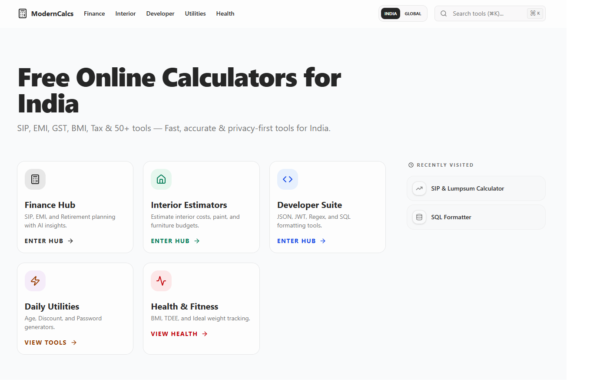
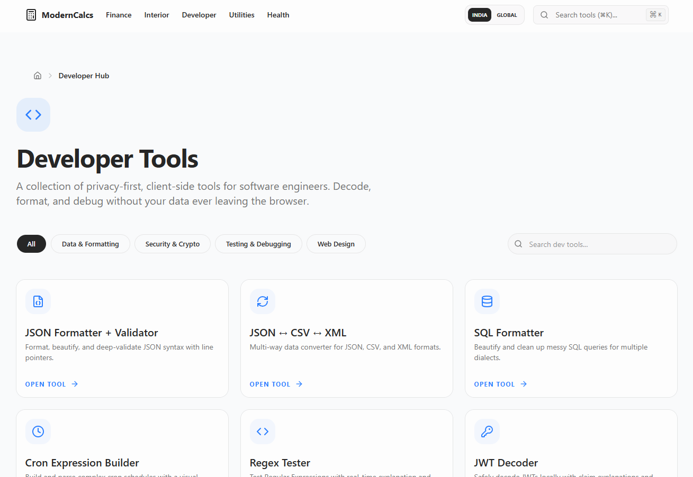
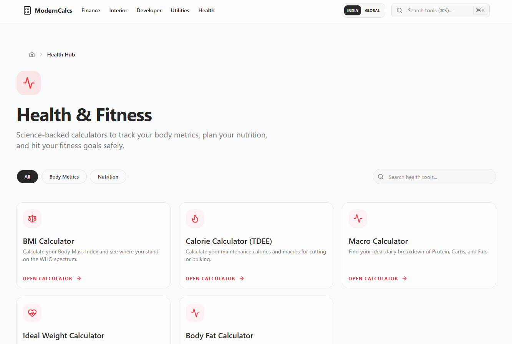
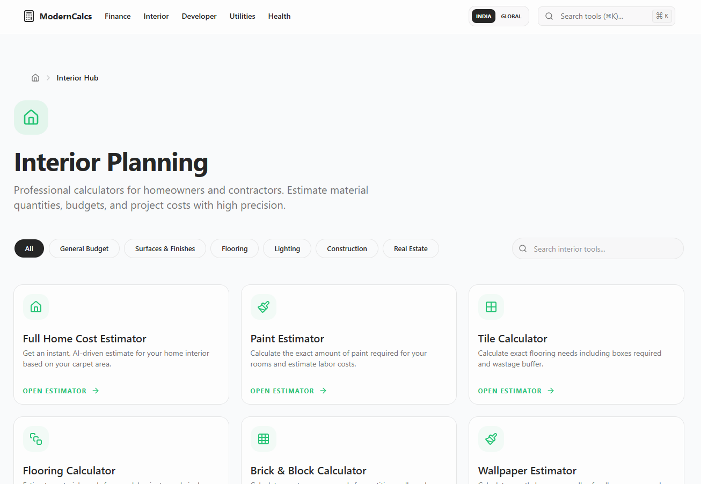

# ModernCalcs — Free Online Calculators for India

> 70+ privacy-first, client-side calculators and developer tools built for the Indian market.
> No login. No tracking. No ads. All calculations run in your browser.

🌐 **Live:** [https://moderncalcs.com](https://moderncalcs.com)

---

## What is ModernCalcs?

ModernCalcs is a free, open-access utility platform with 70+ specialized tools designed specifically for Indian users and developers. Unlike generic calculator sites, every tool here understands Indian context — ₹ formatting, GST slabs, SIP returns, CIBIL scores, state-wise DISCOM electricity rates, and Indian land units (bigha, gaj, cent).

All calculations are **100% client-side** — your financial data, health metrics, and sensitive tokens never leave your browser.

---
## 📸 Screenshots

### 🏠 Homepage

### 💰 Finance Hub

### 💻 Developer Tools

### 🏥 Health & Fitness

### 🏠 Interior & Construction

### 🔧 Daily Utilities

---

## 🧮 Finance Calculators (India-focused)

| Tool | URL |
|------|-----|
| SIP & Lumpsum Calculator | [/finance/sip-calculator](https://moderncalcs.com/finance/sip-calculator) |
| Home Loan EMI (Section 80C & 24) | [/finance/home-loan-calculator](https://moderncalcs.com/finance/home-loan-calculator) |
| Income Tax AY 2025-26 (New vs Old) | [/finance/income-tax-india](https://moderncalcs.com/finance/income-tax-india) |
| GST Calculator (5/12/18/28% slabs) | [/finance/gst-calculator](https://moderncalcs.com/finance/gst-calculator) |
| CTC to In-Hand Salary (PF, PT, HRA) | [/finance/salary-calculator](https://moderncalcs.com/finance/salary-calculator) |
| CIBIL Score Simulator | [/finance/cibil-simulator](https://moderncalcs.com/finance/cibil-simulator) |
| Gratuity Calculator (Gratuity Act 1972) | [/finance/gratuity-calculator](https://moderncalcs.com/finance/gratuity-calculator) |
| Electricity Bill (State DISCOM rates) | [/finance/electricity-calculator](https://moderncalcs.com/finance/electricity-calculator) |
| Land Unit Converter (Bigha/Gaj/Cent) | [/finance/land-unit-converter](https://moderncalcs.com/finance/land-unit-converter) |
| FD Ladder Strategy | [/finance/fd-ladder](https://moderncalcs.com/finance/fd-ladder) |
| Car & Bike Loan (On-road price builder) | [/finance/car-loan-calculator](https://moderncalcs.com/finance/car-loan-calculator) |
| Rent vs Buy (City-wise analysis) | [/finance/rent-vs-buy](https://moderncalcs.com/finance/rent-vs-buy) |
| PPF / EPF / NPS Comparison | [/finance/retirement-schemes](https://moderncalcs.com/finance/retirement-schemes) |
| FIRE Calculator | [/finance/fire-calculator](https://moderncalcs.com/finance/fire-calculator) |
| Education Loan (Section 80E) | [/finance/education-loan](https://moderncalcs.com/finance/education-loan) |
| IT Act Depreciation (WDV method) | [/finance/depreciation-calculator](https://moderncalcs.com/finance/depreciation-calculator) |
| Startup Runway Calculator | [/finance/runway-calculator](https://moderncalcs.com/finance/runway-calculator) |

---

## 💻 Developer Tools

| Tool | URL |
|------|-----|
| JSON Formatter & Validator | [/developer/json-formatter](https://moderncalcs.com/developer/json-formatter) |
| JWT Decoder (client-side, token never sent) | [/developer/jwt-decoder](https://moderncalcs.com/developer/jwt-decoder) |
| Regex Tester with live highlights | [/developer/regex-tester](https://moderncalcs.com/developer/regex-tester) |
| UUID Generator (v1/v4) | [/developer/uuid-generator](https://moderncalcs.com/developer/uuid-generator) |
| SQL Formatter & Beautifier | [/developer/sql-formatter](https://moderncalcs.com/developer/sql-formatter) |
| Base64 Encode / Decode | [/developer/base64-tool](https://moderncalcs.com/developer/base64-tool) |
| URL Encode / Decode | [/developer/url-encoder](https://moderncalcs.com/developer/url-encoder) |
| Cron Expression Parser | [/developer/cron-parser](https://moderncalcs.com/developer/cron-parser) |
| Diff Checker | [/developer/diff-checker](https://moderncalcs.com/developer/diff-checker) |
| CSS Converter | [/developer/css-converter](https://moderncalcs.com/developer/css-converter) |
| IP Subnet Calculator | [/developer/ip-subnet-calculator](https://moderncalcs.com/developer/ip-subnet-calculator) |
| Timezone Calculator (IST focus) | [/developer/timezone-calculator](https://moderncalcs.com/developer/timezone-calculator) |
| Bandwidth Calculator | [/developer/bandwidth-calculator](https://moderncalcs.com/developer/bandwidth-calculator) |

---

## 🏥 Health & Fitness

| Tool | URL |
|------|-----|
| BMI Calculator (Asian/Indian cut-offs) | [/health/bmi-calculator](https://moderncalcs.com/health/bmi-calculator) |
| Calorie & TDEE Calculator | [/health/calorie-calculator](https://moderncalcs.com/health/calorie-calculator) |
| Macro Calculator | [/health/macro-calculator](https://moderncalcs.com/health/macro-calculator) |
| Body Fat Calculator | [/health/body-fat](https://moderncalcs.com/health/body-fat) |
| Ideal Weight Calculator | [/health/ideal-weight](https://moderncalcs.com/health/ideal-weight) |

---

## 🏠 Interior & Construction

| Tool | URL |
|------|-----|
| Tile Calculator | [/interior/tile-calculator](https://moderncalcs.com/interior/tile-calculator) |
| Paint Estimator | [/interior/paint-estimator](https://moderncalcs.com/interior/paint-estimator) |
| Flooring Calculator | [/interior/flooring-calculator](https://moderncalcs.com/interior/flooring-calculator) |
| Interior Cost Estimator | [/interior/cost-estimator](https://moderncalcs.com/interior/cost-estimator) |
| Wallpaper Estimator | [/interior/wallpaper-estimator](https://moderncalcs.com/interior/wallpaper-estimator) |
| Brick Calculator | [/interior/brick-calculator](https://moderncalcs.com/interior/brick-calculator) |
| Area Converter | [/interior/area-converter](https://moderncalcs.com/interior/area-converter) |

---

## 🔧 Daily Utilities

| Tool | URL |
|------|-----|
| Age Calculator + Govt Job Eligibility | [/utilities/age-calculator](https://moderncalcs.com/utilities/age-calculator) |
| Discount Calculator | [/utilities/discount-calculator](https://moderncalcs.com/utilities/discount-calculator) |
| Password Generator | [/utilities/password-generator](https://moderncalcs.com/utilities/password-generator) |
| Sleep Calculator | [/utilities/sleep-calculator](https://moderncalcs.com/utilities/sleep-calculator) |
| Date Toolkit | [/utilities/date-toolkit](https://moderncalcs.com/utilities/date-toolkit) |
| Work Hours Calculator | [/utilities/work-hours-calculator](https://moderncalcs.com/utilities/work-hours-calculator) |
| Heat Index Calculator | [/utilities/heat-index-calculator](https://moderncalcs.com/utilities/heat-index-calculator) |
| Roman Numeral Converter | [/utilities/roman-converter](https://moderncalcs.com/utilities/roman-converter) |
| Shoe Size Converter | [/utilities/shoe-size-converter](https://moderncalcs.com/utilities/shoe-size-converter) |

---

## 🔒 Privacy Architecture

ModernCalcs is built on a **client-side-first** architecture:

- ✅ All calculations run in your browser — zero server requests for computation
- ✅ Financial data (salary, loans, tax) never transmitted to any server
- ✅ Developer tokens (JWT, Base64, regex patterns) processed locally only
- ✅ No user accounts, no cookies, no tracking pixels
- ✅ No ads, no popups, no paywalls

---

## 🛠️ Tech Stack

| Layer | Technology |
|-------|------------|
| Framework | Next.js 16 (App Router) |
| Language | TypeScript |
| Styling | Tailwind CSS v4 |
| UI Components | shadcn/ui + Radix UI |
| Charts | Recharts |
| Runtime | React 19 |
| Hosting | Vercel (Edge Network) |
| Fonts | Geist (local, no CDN) |
 
---

## 🔗 Quick Links

| Page | URL |
|------|-----|
| 🏠 Homepage | https://moderncalcs.com |
| 💰 Finance Hub | https://moderncalcs.com/finance |
| 💻 Developer Tools | https://moderncalcs.com/developer |
| 🏥 Health Hub | https://moderncalcs.com/health |
| 🏠 Interior Hub | https://moderncalcs.com/interior |
| 🔧 Utilities | https://moderncalcs.com/utilities |
| 🗺️ Sitemap | https://moderncalcs.com/sitemap.xml |
| 🔒 Privacy Policy | https://moderncalcs.com/privacy-policy |

---

*Built for India. Runs in your browser. Free forever.*
